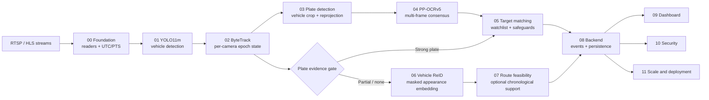

# SentinelTrack

[](https://github.com/mdshoaibuddinchanda/sentineltrack/actions/workflows/ci.yml)
[](https://www.python.org/)
[](https://fastapi.tiangolo.com/)
[](09_dashboard/)
[](https://www.postgresql.org/)

SentinelTrack is a production-oriented, multi-camera vehicle intelligence and ANPR platform prepared for the Sentinel Gujarat CCTV integration challenge. It combines plate-first identity evidence with conservative tracking, route feasibility, auditability, and a review-safe vehicle appearance fallback.

This repository contains the implementation, reproducible evidence, and final hackathon submission package. It does not claim that appearance-only matching establishes a police identity.

## At a glance

| Capability | Implementation | Safety boundary |
| --- | --- | --- |
| Stream ingestion | RTSP/HLS readers, PTS health, bounded queues | UTC provenance is preserved |
| Vehicle detection | YOLO11m, pinned Ultralytics runtime | Canonical path is in `models/manifest.json` |
| Tracking | Per-camera ByteTrack with epoch/gap resets | Track IDs are camera/epoch scoped |
| Plate detection | Selected P11.5 clean single-class YOLO candidate | Cropped coordinates are reprojected to frame space |
| Plate OCR | PP-OCRv5 Mobile ONNX and multi-frame consensus | Strong identity requires corroboration |
| Target matching | Normalization, confusion-aware fuzzy matching, watchlists | Existing P5 alert safeguards remain authoritative |
| Vehicle ReID | MobileNetV3-Small 576-D appearance baseline | Fallback only; appearance-only is `POSSIBLE/REVIEW` |
| Route reasoning | Chronological camera graph and lower-bound feasibility | Not road-level routing |
| Operations | FastAPI/WebSocket backend and React dashboard | Security and audit surfaces are tested |

## Architecture



The identity hierarchy is deliberate: strong ANPR wins; partial plates may receive appearance and temporal support; no-plate appearance suggestions remain review-only. P6 cannot bypass P5 matching, watchlist logic, OCR normalization, or alert safeguards.

## Priority status

| Stage | Status | Scope |
| --- | --- | --- |
| P0 | Complete | Foundation and ingestion |
| P1 | Complete | Vehicle detection |
| P2 | Complete | Single-camera tracking |
| P3 | Complete | Plate detection and crop provenance |
| P4 | Complete | OCR and temporal consensus |
| P5 | Complete | Target matching and watchlists |
| P6 | Frozen | Conservative vehicle appearance fallback |
| P7 | Complete | Chronological route/feasibility engine |
| P8 | Complete | Backend orchestration and event delivery |
| P9 | Complete | Operator dashboard |
| P10 | Complete | Security and privacy controls |
| P11 | Complete | Scale/deployment evidence |
| P12 | Complete | Final hackathon submission package |

## Repository layout

```text
00_foundation/       streams, catalogue, registry
01_vehicle_detection YOLO11m detector and benchmarks
02_tracking/         ByteTrack and track lifecycle
03_plate_detection/  plate model, cropper, quality, training
04_plate_ocr/        OCR, grammar, voting, evaluation
05_target_matching/  watchlists, scoring, alerts, history
06_vehicle_reid/     bounded appearance fallback
07_route_engine/     chronological route/feasibility logic
08_backend/          API, services, event bus, worker
09_dashboard/        React + TypeScript control-room UI
10_security/         auth, authorization, audit, CSRF
11_scale_deployment/ scheduler, capacity, health, deployment
12_submission/       evaluator-facing package and diagrams
configs/             runtime and experiment configuration
docs/                architecture, operations, security, release docs
models/              operational manifest and local model directories
reports/             tracked evidence and evaluation artifacts
scripts/             setup and demo entry points
tools/               preflight, benchmark, evaluation, and evidence tools
tests/               cross-stage contract tests
```

Large datasets, generated runs, caches, and model binaries are local/ignored artifacts. They are inventoried in [`docs/release/REPOSITORY_AUDIT.md`](docs/release/REPOSITORY_AUDIT.md); `runs/` is evidence/experiment storage, never the production source of truth.

## Canonical runtime models

The operational source of truth is [`models/manifest.json`](models/manifest.json). Runtime code resolves model paths from the repository root and does not depend on CWD downloads, `runs/`, Torch cache, or a developer’s absolute path.

| Consumer | Model | Canonical path |
| --- | --- | --- |
| P1 | YOLO11m | `models/vehicle/yolo11m.pt` |
| P3 | Selected P11.5 clean YOLO11s plate model | `models/plate/yolo11s_plate_v2.pt` |
| P4 | PP-OCRv5 Mobile recognition ONNX | `models/ocr/PP-OCRv5_mobile_rec_infer.onnx` |
| P6 | MobileNetV3-Small ImageNet appearance baseline, 576-D | `models/reid/mobilenet_v3_small-047dcff4.pth` |

The P6 checkpoint is optional at runtime and remains review-only. Superseded and experimental artifacts are retained outside the operational manifest for provenance.

## Configuration precedence

Use this order when changing a runtime setting:

1. Checked-in subsystem YAML under `configs/`.
2. Environment variables from `.env` (never commit `.env`).
3. Explicit command-line arguments.

`models/manifest.json` controls model identity, path, required/optional status, and SHA-256. Experiment profiles and historical model evidence do not override it.

## Setup with Conda `PY312`

```bash
git clone https://github.com/mdshoaibuddinchanda/sentineltrack.git
cd sentineltrack
conda activate PY312
python -m pip install -r requirements.txt
copy .env.example .env       # Windows; use cp on POSIX
python scripts/setup_models.py
python tools/preflight.py
```

`setup_models.py` creates canonical directories, downloads/verifies public models, verifies SHA-256 values, and reports missing project-trained artifacts explicitly. Server OCR and YOLO26 are optional/experimental and are not installed by the production bundle.

For a no-network verification of an already provisioned machine:

```bash
python scripts/setup_models.py --verify-only
```

Start local PostgreSQL/PostGIS with `docker compose up -d postgres` when using the full stack. The preflight command bounds its database probe and returns a warning if the local database is stopped.

## Demo and services

```bash
# Native diagnostics and launch instructions
scripts\run_demo.ps1       # Windows PowerShell
./scripts/run_demo.sh      # Linux/macOS

# API
python -m uvicorn 08_backend.app:app --host 0.0.0.0 --port 8000

# Frontend
cd 09_dashboard
npm ci
npm run dev
```

The evaluator-facing demo runbook is [`12_submission/DEMO_RUNBOOK.md`](12_submission/DEMO_RUNBOOK.md). It describes fixture mode, live prerequisites, and evidence capture without claiming production deployment.

## Testing and validation

```bash
python -m pytest -q
python -m pytest tests/test_p6_vehicle_reid.py 08_backend/tests/test_analytics_reid_integration.py -q
python -m compileall -q 00_foundation 01_vehicle_detection 02_tracking 03_plate_detection 04_plate_ocr 05_target_matching 06_vehicle_reid 07_route_engine 08_backend 10_security 11_scale_deployment scripts tools
python tools/preflight.py
```

Frontend gates:

```bash
cd 09_dashboard
npm run typecheck
npm run lint
npx vitest run
npm run build
```

GitHub Actions runs the backend security/scale contract gate and the frontend typecheck, lint, test, and build gate. See [`.github/workflows/ci.yml`](.github/workflows/ci.yml).

## Evidence and documentation

- [`docs/README.md`](docs/README.md) — documentation index.
- [`docs/release/REPOSITORY_AUDIT.md`](docs/release/REPOSITORY_AUDIT.md) — tracked/ignored inventory and cleanup decisions.
- [`docs/release/MODEL_INVENTORY.md`](docs/release/MODEL_INVENTORY.md) — selected, legacy, and experimental model evidence.
- [`reports/p6/P6_REPORT.md`](reports/p6/P6_REPORT.md) — P6 proxy evaluation and safety boundary.
- [`reports/p11_5/FINAL_REPORT.md`](reports/p11_5/FINAL_REPORT.md) — frozen P11.5 evidence.
- [`12_submission/README.md`](12_submission/README.md) — final submission navigation.

## Security and privacy

Authentication, authorization, CSRF, rate limiting, security headers, audit events, retention, and data-classification decisions are documented under [`docs/security/`](docs/security/) and implemented/tested in `10_security/`. Do not commit credentials, raw watchlists, raw video, or unreviewed personal data.

## Scale and operational honesty

P11 scale documents provide a bounded architecture projection, storage/bandwidth arithmetic, HA/DR design, and a rollout plan. They are not a claim that this checkout has been deployed to 80,000 cameras. P7 provides chronological lower-bound feasibility, not live road routing. P6 provides appearance retrieval evidence only because no true cross-camera vehicle-ID ground truth exists locally.

## Screenshots

The dashboard is implemented under `09_dashboard/` and includes deterministic fixture data for presentation. No generated or potentially sensitive runtime screenshot is committed in this release; capture a fresh redacted screenshot from the demo environment when required by the submission portal.

## License

Proprietary / competition submission. Third-party model and dataset terms remain applicable; see the model and evidence inventories before redistribution.
