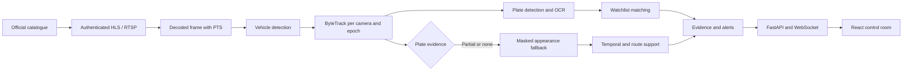

<div align="center">

# SENTINELTRACK

### Evidence-first vehicle intelligence for Gujarat’s multi-camera future

**Observe. Correlate. Explain.**

<p>
  <a href="https://github.com/mdshoaibuddinchanda/sentineltrack/actions/workflows/ci.yml"></a>
  <a href="https://www.python.org/"></a>
  <a href="09_dashboard/"></a>
  <a href="https://fastapi.tiangolo.com/"></a>
  <a href="LICENSE"></a>
</p>

<p>
  <a href="12_submission/README.md">Hackathon package</a> ·
  <a href="12_submission/DEMO_RUNBOOK.md">Demo runbook</a> ·
  <a href="docs/TESTING_GUIDE.md">Testing guide</a> ·
  <a href="SECURITY.md">Security policy</a>
</p>

</div>

SentinelTrack is a multi-camera vehicle intelligence platform for the Gujarat
Sentinel CCTV integration challenge. It receives permitted camera metadata and
video, detects vehicles, reads number plates, follows vehicles within a camera,
correlates sightings across cameras, and presents evidence to an operator.

The system is designed around one simple rule: every result must explain its
source. A camera row is not considered live until the worker decodes a current
frame. A plate result is not treated as a strong identity without corroboration.
Appearance similarity is a conservative review signal, never a replacement for
ANPR.

> **Current live-status boundary:** the local checkout contains the official
> camera registry records, but the organizer feed portal requires an issued
> access password. Until that password is present in local `.env`, no live
> government frame or model detection can honestly be claimed.

## What the platform does

| Area | Responsibility | Operator-visible evidence |
| --- | --- | --- |
| Camera registry | Imports the permitted catalogue and normalizes camera metadata. | Camera ID, location label, protocol, source state, and health details. |
| Stream ingestion | Opens protected HLS or RTSP sources with bounded recovery. | Decoded-frame count, sampled-frame count, reconnects, freshness, and error reason. |
| Vehicle analytics | Runs vehicle detection and per-camera tracking. | Vehicle boxes, track IDs, timestamps, and model provenance. |
| ANPR | Detects plate regions, reads text, and combines observations over time. | Raw/normalized candidates, quality, consensus support, and decision reason. |
| Target matching | Compares verified plate evidence against an authorized watchlist. | Match class, score, alert severity, and audit trail. |
| Vehicle appearance | Supplies a masked, track-level ReID fallback when plate evidence is incomplete. | `ANPR_REID_SUPPORT` or `REID_REVIEW`; never an appearance-only high-severity claim. |
| Route investigation | Orders sightings and checks lower-bound time/distance feasibility. | Camera sequence, timestamps, locations, and feasibility explanation. |
| Control room | Provides the secured API, WebSocket events, and React dashboard. | Cameras, alerts, watchlist, investigation, system health, and audit views. |

## Identity and safety policy

SentinelTrack uses a plate-first hierarchy:

| Evidence available | System behavior |
| --- | --- |
| Strong/full plate | ANPR remains authoritative. ReID is skipped or logged diagnostically and cannot override it. |
| Partial/degraded plate | Plate evidence may be supported by appearance, time, and route feasibility. It cannot become an exact identity from appearance alone. |
| No usable plate | Appearance is fallback evidence only. The result remains `POSSIBLE`/`REVIEW` and cannot create an automatic `HIGH` or `CRITICAL` identity alert. |

The implementation does not pass OCR text into the appearance model. If a plate
box is available inside the vehicle crop, that region is masked before the
appearance embedding is calculated. Stream epochs scope tracker and ReID state
so an old track cannot silently cross a reconnect boundary.

## End-to-end flow



The runtime is split into numbered stages so each responsibility has a clear
home. The numbers describe ownership, not a mandatory reading order.

## Repository map

| Directory | Contents |
| --- | --- |
| `00_foundation/` | Stream readers, catalogue client, frame packets, registry, and shared infrastructure. |
| `01_vehicle_detection/` | YOLO11m vehicle detector and local benchmarks. |
| `02_tracking/` | ByteTrack state and track lifecycle management. |
| `03_plate_detection/` | Plate detector, crop validation, quality scoring, and training utilities. |
| `04_plate_ocr/` | PP-OCRv5 Mobile recognition, grammar, consensus, and evaluation. |
| `05_target_matching/` | Watchlists, normalization, matching safeguards, alerts, and history. |
| `06_vehicle_reid/` | Bounded MobileNetV3-Small appearance fallback. |
| `07_route_engine/` | Chronological sightings, feasibility checks, GeoJSON, and reports. |
| `08_backend/` | FastAPI application, services, authentication boundary, event bus, and workers. |
| `09_dashboard/` | React, TypeScript, Vite, dashboard pages, and live camera relay UI. |
| `10_security/` | Authentication, authorization, CSRF, audit, and security tests. |
| `11_scale_deployment/` | Fair scheduling, bounded queues, health, sharding, and deployment planning. |
| `12_submission/` | Hackathon report, HLD, evidence map, runbook, scripts, and checklist. |
| `configs/` | Active runtime configuration. |
| `models/` | Model manifest and locally provisioned model files. |
| `reports/` | Tracked evaluation and benchmark evidence. |
| `scripts/` | Setup and verification helpers. |
| `tools/` | Preflight, schema, cleanup, doctor, benchmark, and evidence tools. |
| `tests/` | Cross-stage contract tests. |
| `docs/` | Architecture, operations, security, reproducibility, and release audits. |

Datasets, raw media, generated runs, logs, caches, frontend dependencies, and
model binaries are local provisioning artifacts and are ignored by Git. Their
provenance and cleanup decisions are recorded in
[`docs/release/REPOSITORY_AUDIT.md`](docs/release/REPOSITORY_AUDIT.md).

## Canonical runtime models

The operational source of truth is [`models/manifest.json`](models/manifest.json).
It records model identity, path, required/optional status, and SHA-256.

| Stage | Selected runtime model | Local path |
| --- | --- | --- |
| Vehicle detection | YOLO11m | `models/vehicle/yolo11m.pt` |
| Plate detection | Selected P11.5 YOLO11s candidate | `models/plate/yolo11s_plate_v2.pt` |
| Plate recognition | PP-OCRv5 Mobile ONNX | `models/ocr/PP-OCRv5_mobile_rec_infer.onnx` |
| Appearance fallback | MobileNetV3-Small ImageNet baseline, 576-D | `models/reid/mobilenet_v3_small-047dcff4.pth` |

The appearance model is a retrieval baseline, not a claim of trained
cross-camera vehicle identity accuracy. No true cross-camera vehicle-ID ground
truth is available in the local dataset, so P6 reports proxy pair evidence only.

## Run with Conda `PY312`

The normal Windows path is:

```powershell
conda activate PY312
Set-Location C:\DR2\sentineltrack
python -m pip install -r requirements.txt
docker compose up -d postgres
python tools\preflight.py
python tools\doctor.py
run.bat --full
```

The launcher starts PostgreSQL/PostGIS when needed, the API on port `8000`, and
the dashboard on port `5173`. It uses the configured account and does not create
a temporary demo account or insert fake alerts.

### Configure the official feed

The camera catalogue and media endpoints are protected by the organizer portal.
Put the issued password only in the local, ignored `.env` file:

```dotenv
SENTINEL_HOST=https://cctv.corp8.cloud
SENTINEL_ACCESS_PASSWORD=<organizer-issued-password>
```

Then run:

```powershell
python -m 00_foundation.scripts.fetch_catalogue
python tools\doctor.py
run.bat --full
```

The password is used to create an in-memory session. It is not printed, stored
in a URL, committed, or passed to the browser. The launcher reports
`AUTH_REQUIRED` when the credential is absent; it does not substitute mock
feeds.

The current organizer portal publishes `GET /cameras.json` after authentication
and uses camera IDs `cam01` through `cam30`. SentinelTrack keeps compatibility
with the older `/api/ingest` contract, derives the portal HLS playlist path, and
derives the direct RTSP/TCP inference path from the published ID. In the local
inference profile, RTSP/TCP is primary so a decoder that cannot open the portal's
encrypted HLS playlist does not make a healthy camera appear offline.

### How to prove a camera is live

Use the Cameras page or the authenticated relay endpoint:

```text
http://127.0.0.1:8000/api/v1/cameras/<camera-id>/live
```

This is a continuous MJPEG relay backed by the worker's current decoded frame.
It is not a still-image refresh and it does not expose the upstream camera URL.
A camera becomes `ONLINE` only after a fresh frame is decoded. `Configured`,
`Connecting`, `Access required`, `Decode error`, and `Stale` are separate states.

The dashboard and API expose the evidence needed to answer whether analytics are
running: decoded frames, sampled frames, active tracks, model readiness,
inference counters, reconnects, and the latest error. If decoded frames are
zero, the model cannot be processing that source.

### Camera overview and continuous video

Open **Cameras** after login. The default **Overview** shows every registered
camera in one screen with its latest authenticated worker snapshot, online
state, measured FPS, decoded-frame count, freshness, and connection error. The
overview refreshes snapshots every five seconds and deliberately does not open
30 simultaneous video relays. Select any tile to switch automatically to the
camera detail view, where the authenticated continuous MJPEG relay, worker
telemetry, coordinates, and nearby-camera information are available. The
**List** button returns to the table view.

The overview is a health-and-operations screen, not fabricated playback. A
source marked `ONLINE` means the worker has decoded a current frame; a missing
snapshot or stale counter is shown as a real dependency state.

The header's clearly labelled **Privacy on/off** control masks or reveals
vehicle registration numbers in operator views. It is a privacy control—not an
AI switch. Keep privacy mode on while presenting screens to anyone who is not
authorized to view full registrations.

### Add the authorized target

An empty watchlist is intentional after the local demo-data cleanup. Add only
the registration authorized for the challenge through the Watchlist page or the
protected target API. The system must never invent a target or an alert.

## Validation commands

Backend and repository checks:

```powershell
python -m pytest -q
python -m compileall -q 00_foundation 01_vehicle_detection 02_tracking 03_plate_detection 04_plate_ocr 05_target_matching 06_vehicle_reid 07_route_engine 08_backend 10_security 11_scale_deployment scripts tools
python tools\preflight.py
python tools\doctor.py
```

Frontend checks:

```powershell
Set-Location 09_dashboard
npm ci
npm run typecheck
npm run lint
npx vitest run
npm run build
```

GitHub Actions runs the security/scale backend gate and the frontend
typecheck, lint, test, and build gates. See
[`.github/workflows/ci.yml`](.github/workflows/ci.yml).

## Documentation starting points

| Question | Document |
| --- | --- |
| How do I run and record the software? | [`12_submission/DEMO_RUNBOOK.md`](12_submission/DEMO_RUNBOOK.md) |
| What is the evaluator package? | [`12_submission/README.md`](12_submission/README.md) |
| How is the platform structured? | [`12_submission/HLD.md`](12_submission/HLD.md) and [`12_submission/ARCHITECTURE.md`](12_submission/ARCHITECTURE.md) |
| What official requirements were checked? | [`12_submission/OFFICIAL_REQUIREMENTS_MATRIX.md`](12_submission/OFFICIAL_REQUIREMENTS_MATRIX.md) |
| What is the current live-runtime diagnosis? | [`docs/release/LIVE_RUNTIME_AUDIT.md`](docs/release/LIVE_RUNTIME_AUDIT.md) |
| What evidence is measured? | [`12_submission/EVIDENCE_INVENTORY.md`](12_submission/EVIDENCE_INVENTORY.md) and [`reports/`](reports/) |
| How are tests run? | [`docs/TESTING_GUIDE.md`](docs/TESTING_GUIDE.md) |
| How is the repository cleaned? | [`docs/release/FINAL_HYGIENE_AUDIT.md`](docs/release/FINAL_HYGIENE_AUDIT.md) |
| How are security and privacy handled? | [`SECURITY.md`](SECURITY.md) and [`docs/security/`](docs/security/) |

Historical experiments and development baselines remain under
`experiments/archive/` and `docs/archive/`. They are retained for provenance,
not used as active runtime instructions.

## Official challenge references

The implementation and submission package were aligned against the public
official pages:

- [Problems](https://sentinel.gujarat.gov.in/problems)
- [FAQs](https://sentinel.gujarat.gov.in/faqs)
- [Resource and integration guide](https://sentinel.gujarat.gov.in/resource)
- [Phases and prizes](https://sentinel.gujarat.gov.in/phases)

The published challenge describes a registry/GIS foundation, permitted
multi-camera feeds, a designated-vehicle test case, timestamped output,
working-software demonstration, and a statewide scale plan. External organizer
credentials, designated vehicle data, team eligibility, and portal-only upload
fields are not present in this repository and must be supplied by the submission
owner.

## License and responsible use

SentinelTrack is released under the
[SentinelTrack Academic and Non-Commercial Evaluation License](LICENSE).
Academic research, teaching, evaluation, and hackathon judging are permitted.
Commercial use, production deployment, operational surveillance, paid services,
and other use outside that scope require prior written permission from the
copyright holder. This is a custom restrictive license, not an OSI-approved
open-source license.

Third-party models, datasets, fonts, and libraries retain their own licenses.
Review [`docs/release/MODEL_INVENTORY.md`](docs/release/MODEL_INVENTORY.md)
before redistributing any component. SentinelTrack is decision-support
software; deploying departments remain responsible for authorization, lawful
use, retention, security, and human review.
