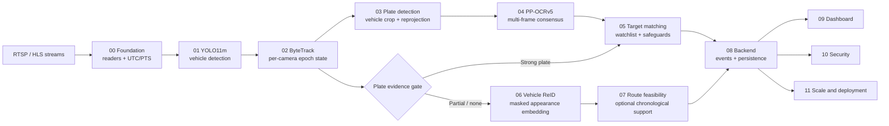

<div align="center">

# SENTINELTRACK

### Evidence-first vehicle intelligence for Gujarat’s multi-camera future

**Observe. Correlate. Explain.**

<p>
  <a href="https://github.com/mdshoaibuddinchanda/sentineltrack/actions/workflows/ci.yml"></a>
  <a href="https://www.python.org/"></a>
  <a href="09_dashboard/"></a>
  <a href="https://fastapi.tiangolo.com/"></a>
  <a href="LICENSE"></a>
</p>

<p>
  <a href="12_submission/README.md">Hackathon package</a> ·
  <a href="12_submission/DEMO_RUNBOOK.md">Demo runbook</a> ·
  <a href="docs/TESTING_GUIDE.md">Testing guide</a> ·
  <a href="SECURITY.md">Security policy</a>
</p>

</div>

SentinelTrack is a production-oriented, multi-camera vehicle intelligence and ANPR platform prepared for the Sentinel Gujarat CCTV integration challenge. It turns heterogeneous camera observations into traceable evidence: plate-first identity, per-camera tracking, chronological feasibility, auditable decisions, and a conservative vehicle-appearance fallback.

> **The promise:** help an operator find and explain a vehicle movement across cameras.
> **The boundary:** appearance-only evidence never becomes an automatic police identity claim.

## Why this submission stands out

| Signal | What SentinelTrack delivers | Why it matters |
| --- | --- | --- |
| **Evidence before confidence** | Every sighting preserves camera, time, quality, source, and explanation metadata. | Operators can inspect why a result was suggested. |
| **Plate-first identity** | Strong ANPR remains authoritative; ReID supports only partial or missing plates. | A visual similarity cannot silently override a known plate. |
| **Operational realism** | Bounded queues, stale-frame handling, fair scheduling, health signals, audit, RBAC, and CSRF protection. | The design addresses the control-room environment, not only a notebook demo. |
| **Honest scale story** | Regional inference, sharding, capacity arithmetic, HA/DR, and rollout gates are documented as measured or projected. | The submission separates evidence from assumptions. |

## Quick navigation

| I want to… | Start here |
| --- | --- |
| See the evaluator story | [`12_submission/FINAL_SUBMISSION_REPORT.md`](12_submission/FINAL_SUBMISSION_REPORT.md) |
| Run the five-minute demo | [`12_submission/DEMO_RUNBOOK.md`](12_submission/DEMO_RUNBOOK.md) |
| Understand the architecture | [`12_submission/HLD.md`](12_submission/HLD.md) and [`12_submission/ARCHITECTURE.md`](12_submission/ARCHITECTURE.md) |
| Inspect measured evidence | [`12_submission/EVIDENCE_INVENTORY.md`](12_submission/EVIDENCE_INVENTORY.md) and [`reports/`](reports/) |
| Understand tests and caches | [`docs/TESTING_GUIDE.md`](docs/TESTING_GUIDE.md) |
| Review security/privacy | [`SECURITY.md`](SECURITY.md), [`12_submission/SECURITY_PRIVACY.md`](12_submission/SECURITY_PRIVACY.md), and [`docs/security/`](docs/security/) |
| Browse the documentation map | [`docs/README.md`](docs/README.md) |

## At a glance

| Capability | Implementation | Safety boundary |
| --- | --- | --- |
| Stream ingestion | RTSP/HLS readers, PTS health, bounded queues | UTC provenance is preserved |
| Vehicle detection | YOLO11m, pinned Ultralytics runtime | Canonical path is in `models/manifest.json` |
| Tracking | Per-camera ByteTrack with epoch/gap resets | Track IDs are camera/epoch scoped |
| Plate detection | Selected P11.5 clean single-class YOLO candidate | Cropped coordinates are reprojected to frame space |
| Plate OCR | PP-OCRv5 Mobile ONNX and multi-frame consensus | Strong identity requires corroboration |
| Target matching | Normalization, confusion-aware fuzzy matching, watchlists | Existing P5 alert safeguards remain authoritative |
| Vehicle ReID | MobileNetV3-Small 576-D appearance baseline | Fallback only; appearance-only is `POSSIBLE/REVIEW` |
| Route reasoning | Chronological camera graph and lower-bound feasibility | Not road-level routing |
| Operations | FastAPI/WebSocket backend and React dashboard | Security and audit surfaces are tested |

## Architecture



The identity hierarchy is deliberate: strong ANPR wins; partial plates may receive appearance and temporal support; no-plate appearance suggestions remain review-only. P6 cannot bypass P5 matching, watchlist logic, OCR normalization, or alert safeguards.

## Priority status

| Stage | Status | Scope |
| --- | --- | --- |
| P0 | Complete | Foundation and ingestion |
| P1 | Complete | Vehicle detection |
| P2 | Complete | Single-camera tracking |
| P3 | Complete | Plate detection and crop provenance |
| P4 | Complete | OCR and temporal consensus |
| P5 | Complete | Target matching and watchlists |
| P6 | Frozen | Conservative vehicle appearance fallback |
| P7 | Complete | Chronological route/feasibility engine |
| P8 | Complete | Backend orchestration and event delivery |
| P9 | Complete | Operator dashboard |
| P10 | Complete | Security and privacy controls |
| P11 | Complete | Scale/deployment evidence |
| P12 | Complete | Final hackathon submission package |

## Repository layout

```text
00_foundation/       streams, catalogue, registry
01_vehicle_detection YOLO11m detector and benchmarks
02_tracking/         ByteTrack and track lifecycle
03_plate_detection/  plate model, cropper, quality, training
04_plate_ocr/        OCR, grammar, voting, evaluation
05_target_matching/  watchlists, scoring, alerts, history
06_vehicle_reid/     bounded appearance fallback
07_route_engine/     chronological route/feasibility logic
08_backend/          API, services, event bus, worker
09_dashboard/        React + TypeScript control-room UI
10_security/         auth, authorization, audit, CSRF
11_scale_deployment/ scheduler, capacity, health, deployment
12_submission/       evaluator-facing package and diagrams
configs/             live runtime configuration
experiments/archive/ historical experiment inputs and reproducibility scripts
docs/                architecture, operations, security, release docs
models/              operational manifest and local model directories
reports/             tracked evidence and evaluation artifacts
scripts/             setup and demo entry points
tools/               active preflight, benchmark, evaluation, and evidence tools
tests/               cross-stage contract tests
LICENSE              academic/non-commercial evaluation license
SECURITY.md          vulnerability reporting and security boundaries
```

Large datasets, generated caches, and model binaries are local/ignored artifacts. They are inventoried in [`docs/release/REPOSITORY_AUDIT.md`](docs/release/REPOSITORY_AUDIT.md); runtime code never depends on local training output directories.

Historical run outputs are kept outside the checkout under `C:\DR2\sentineltrack_archive\runs` when available; the tracked reports and provenance files remain the reviewable evidence source.

## Canonical runtime models

The operational source of truth is [`models/manifest.json`](models/manifest.json). Runtime code resolves model paths from the repository root and does not depend on CWD downloads, `runs/`, Torch cache, or a developer’s absolute path.

| Consumer | Model | Canonical path |
| --- | --- | --- |
| P1 | YOLO11m | `models/vehicle/yolo11m.pt` |
| P3 | Selected P11.5 clean YOLO11s plate model | `models/plate/yolo11s_plate_v2.pt` |
| P4 | PP-OCRv5 Mobile recognition ONNX | `models/ocr/PP-OCRv5_mobile_rec_infer.onnx` |
| P6 | MobileNetV3-Small ImageNet appearance baseline, 576-D | `models/reid/mobilenet_v3_small-047dcff4.pth` |

The P6 checkpoint is optional at runtime and remains review-only. Superseded and experimental artifacts are retained outside the operational manifest for provenance.

The optional PP-OCR server checkpoint and unpromoted YOLO variants are intentionally outside this checkout; they are not production dependencies.

## Configuration precedence

Use this order when changing a runtime setting:

1. Checked-in subsystem YAML under `configs/`.
2. Environment variables from `.env` (never commit `.env`).
3. Explicit command-line arguments.

`models/manifest.json` controls model identity, path, required/optional status, and SHA-256. Experiment profiles and historical model evidence do not override it.

## Setup with Conda `PY312`

```bash
git clone https://github.com/mdshoaibuddinchanda/sentineltrack.git
cd sentineltrack
conda activate PY312
python -m pip install -r requirements.txt
copy .env.example .env       # Windows; use cp on POSIX
python scripts/setup_models.py
python tools/preflight.py
```

`setup_models.py` creates canonical directories, downloads/verifies public models, verifies SHA-256 values, and reports missing project-trained artifacts explicitly. Server OCR and YOLO26 are optional/experimental and are not installed by the production bundle.

For a no-network verification of an already provisioned machine:

```bash
python scripts/setup_models.py --verify-only
```

Start local PostgreSQL/PostGIS with `docker compose up -d postgres` when using the full stack. The preflight command bounds its database probe and returns a warning if the local database is stopped.

## Demo and services

```bash
# Native diagnostics and launch instructions
scripts\run_demo.ps1       # Windows PowerShell
./scripts/run_demo.sh      # Linux/macOS

# API
python -m uvicorn 08_backend.app:app --host 0.0.0.0 --port 8000

# Frontend
cd 09_dashboard
npm ci
npm run dev -- --host 127.0.0.1 --port 5173
```

For a real local run with the persisted camera sources, start PostgreSQL first
and explicitly enable stream ingestion in the all-in-one backend process:

```powershell
$env:SENTINEL_PROCESS_ROLE = "all"
$env:SENTINEL_ENABLE_STREAM_INGESTION = "true"
python -m uvicorn 08_backend.app:app --host 0.0.0.0 --port 8000
```

The backend loads live camera URLs from the camera registry, uses RTSP with
the stored HLS URL as fallback, and reports connection/decoded-frame counts in
System status. API-only mode remains suitable for CI and dashboard work and
does not open camera connections.

The evaluator-facing demo runbook is [`12_submission/DEMO_RUNBOOK.md`](12_submission/DEMO_RUNBOOK.md). It describes fixture mode, live prerequisites, and evidence capture without claiming production deployment.

For a presentation-only dashboard without a live backend, start Vite with the
deterministic fixture mode enabled:

```powershell
cd 09_dashboard
$env:VITE_DEMO_MODE = "true"
npm run dev -- --host 127.0.0.1 --port 5173
```

The header visibly shows `DEMO: ON`; simulated sightings and alerts must not be
presented as live departmental data.

## Testing and validation

```bash
python -m pytest -q
python -m pytest tests/test_p6_vehicle_reid.py 08_backend/tests/test_analytics_reid_integration.py -q
python -m compileall -q 00_foundation 01_vehicle_detection 02_tracking 03_plate_detection 04_plate_ocr 05_target_matching 06_vehicle_reid 07_route_engine 08_backend 10_security 11_scale_deployment scripts tools
python tools/preflight.py
```

Frontend gates:

```bash
cd 09_dashboard
npm run typecheck
npm run lint
npx vitest run
npm run build
```

GitHub Actions runs the backend security/scale contract gate and the frontend typecheck, lint, test, and build gate. See [`.github/workflows/ci.yml`](.github/workflows/ci.yml).

## Evidence and documentation

- [`docs/README.md`](docs/README.md) — documentation index.
- [`docs/release/REPOSITORY_AUDIT.md`](docs/release/REPOSITORY_AUDIT.md) — tracked/ignored inventory and cleanup decisions.
- [`docs/release/MODEL_INVENTORY.md`](docs/release/MODEL_INVENTORY.md) — selected, legacy, and experimental model evidence.
- [`docs/release/FINAL_HYGIENE_AUDIT.md`](docs/release/FINAL_HYGIENE_AUDIT.md) — final local artifact and repository hygiene record.
- [`docs/release/FINAL_DELETION_REPORT.md`](docs/release/FINAL_DELETION_REPORT.md) — exact deletion, archival, and legacy-tool ledger.
- [`reports/p6/P6_REPORT.md`](reports/p6/P6_REPORT.md) — P6 proxy evaluation and safety boundary.
- [`reports/p11_5/FINAL_REPORT.md`](reports/p11_5/FINAL_REPORT.md) — frozen P11.5 evidence.
- [`12_submission/README.md`](12_submission/README.md) — final submission navigation.

## Security and privacy

Authentication, authorization, CSRF, rate limiting, security headers, audit events, retention, and data-classification decisions are documented under [`docs/security/`](docs/security/) and implemented/tested in `10_security/`. Do not commit credentials, raw watchlists, raw video, or unreviewed personal data.

## Scale and operational honesty

P11 scale documents provide a bounded architecture projection, storage/bandwidth arithmetic, HA/DR design, and a rollout plan. They are not a claim that this checkout has been deployed to 80,000 cameras. P7 provides chronological lower-bound feasibility, not live road routing. P6 provides appearance retrieval evidence only because no true cross-camera vehicle-ID ground truth exists locally.

## Screenshots

The dashboard is implemented under `09_dashboard/` and includes deterministic fixture data for presentation. No generated or potentially sensitive runtime screenshot is committed in this release; follow [`docs/assets/README.md`](docs/assets/README.md) to capture a fresh redacted screenshot when required by the submission portal.

## License and responsible use

The original project source is available under the
[SentinelTrack Academic and Non-Commercial Evaluation License](LICENSE).
Academic research, teaching, evaluation, and hackathon judging are permitted.
Commercial use, production deployment, operational surveillance, paid
services, and other use outside that scope require prior written permission
from the copyright holder. This is a custom restrictive license, not an
OSI-approved open-source license.

Model weights, datasets, fonts, libraries, and other third-party materials
remain subject to their own licenses and terms. Review
[`docs/release/MODEL_INVENTORY.md`](docs/release/MODEL_INVENTORY.md) and the
evidence inventories before using or redistributing any component.

SentinelTrack is decision-support software. Operators and deploying
departments remain responsible for authorization, lawful use, retention,
security, and human review of any identity-related result.
