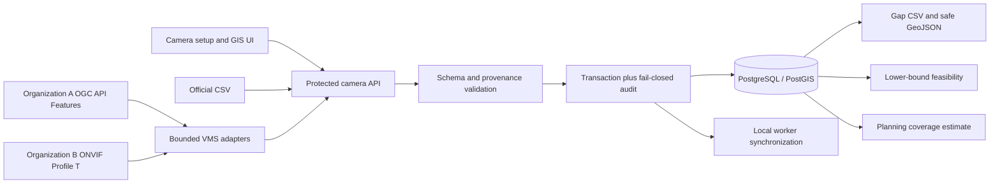

# Camera Registry, GIS, and VMS Integration

This document is the implementation contract for SentinelTrack Model 1. It
describes what the software now performs and separates it from departmental
data and acceptance work that cannot be manufactured inside the repository.

## System boundary

All onboarding paths converge on `CameraRegistryInput`. A connector cannot
bypass URL, location, metadata, transaction, RBAC, or audit controls.

## Registry record

| Group | Fields | Rule |
|---|---|---|
| Identity | `camera_id`, `external_id`, `source_system` | Stable ID; `(source_system, external_id)` is unique when present |
| Ownership | `name`, `department`, `organization` | Nullable until supplied; missing values appear in gap analysis |
| Position | latitude, longitude, azimuth | WGS84 pair; finite and range checked |
| Provenance | location quality, coordinate source, accuracy | GPS requires a non-empty source; absent GPS must remain `UNKNOWN` |
| Planning geometry | coverage radius, field of view | Optional bounded values; never presented as measured visibility without evidence |
| Media | RTSP, HLS, WebRTC/WHEP | Supported schemes only; embedded URL credentials rejected |
| Operations | enabled (`live`), stream status, counters | Enablement is configuration; ONLINE requires a fresh decoded worker frame |
| Traceability | onboarding method, safe metadata, update time | Secrets in nested metadata are rejected |

The schema builds PostGIS geography points only when both coordinates exist.
It never creates a `POINT(0 0)` placeholder.

## Operator workflow

The Cameras page contains one explicitly named **Camera setup and GIS** panel;
no hidden “More” menu or additional top-level navigation is required.

- **Register camera** creates one source.
- **Edit selected camera** completes ownership/GPS metadata for an existing
  source without exposing persisted stream URLs back to the browser.
- **Import camera CSV** parses a bounded file, performs a server dry run, shows
  row-level decisions, and requires a separate apply action.
- **Gap report CSV** exports current missing metadata using spreadsheet-formula
  injection protection.
- **Camera map GeoJSON** exports only safe registry properties and coordinates,
  not stream URLs or secrets.
- **GIS demonstration** evaluates a pair of geolocated cameras and a supplied
  elapsed time, and can estimate coverage for a supplied GeoJSON area.
- **Organization integration readiness** states whether each configured VMS
  adapter is disabled, awaiting credentials, or ready for validation/sync.

CSV batches are limited to 500. The browser parser rejects unknown/duplicate
headers and malformed numbers/booleans; Pydantic and PostgreSQL remain the
authoritative validation layers. The repository template is
[`configs/camera_import_template.csv`](../configs/camera_import_template.csv).

## API surface

| Method and route | Permission | Purpose |
|---|---|---|
| `POST /api/v1/cameras` | `camera:manage` + CSRF | Register one camera |
| `PATCH /api/v1/cameras/{id}/registry` | `camera:manage` + CSRF | Update normalized metadata/source configuration |
| `POST /api/v1/cameras/bulk` | `camera:manage` + CSRF | Dry-run/apply up to 500 records |
| `GET /api/v1/cameras/gap-analysis` | `camera:read` | Current aggregate gap evidence |
| `GET /api/v1/cameras/gap-analysis.csv` | `camera:read` | Audited spreadsheet-safe report |
| `GET /api/v1/cameras/export.geojson` | `camera:read` | Audited safe map export |
| `POST /api/v1/cameras/coverage-analysis` | `camera:read` + CSRF | AOI planning approximation |
| `GET /api/v1/cameras/connectors` | `camera:read` | Secret-free adapter readiness |
| `POST /api/v1/cameras/connectors/{id}/sync` | `camera:manage` + CSRF | Dry-run/apply approved connector |
| `POST /api/v1/routes/feasibility-check` | `route:read` | Non-persisting camera-pair demonstration |

`ADMIN` and `SUPERVISOR` hold `camera:manage`; `OPERATOR` and `AUDITOR` do not.
Existing `camera:read` behavior is unchanged.

## VMS adapter A: OGC API Features

The `OGC_API_FEATURES` adapter consumes one trusted `FeatureCollection` items
endpoint with Point camera features. It accepts an optional bearer token by
environment-variable reference and normalizes identity, ownership, WGS84
geometry, source provenance, stream endpoints, and planning metadata.

Safety bounds:

- HTTPS by default, no redirects, bounded timeout;
- 10 MiB response and 5,000-feature discovery limits;
- valid Feature/Point geometry and coordinate ranges;
- no embedded stream credentials;
- connector provenance retained, then filtered through registry secret checks.

The standard choice follows the current
[OGC API – Features](https://ogcapi.ogc.org/features/index.html) REST/GeoJSON
model. [OGC API – Connected Systems 1.0](https://www.ogc.org/standards/ogc-api-connected-systems/)
is the appropriate future extension for richer system/deployment metadata and
dynamic sensor observations; SentinelTrack does not claim that extension today.

## VMS adapter B: ONVIF Profile T

The `ONVIF_PROFILE_T` adapter represents one configured IP camera. It performs:

1. Device `GetServices` discovery.
2. `GetDeviceInformation` and `GetScopes`.
3. Media2 or Media1 `GetProfiles`.
4. Deterministic highest-resolution profile selection.
5. `GetStreamUri` for RTSP.
6. Removal of any credentials embedded in the returned URL.

It supports HTTP Digest and WS-Security UsernameToken digest because real ONVIF
devices vary. Credentials are loaded from named environment variables, never
the tracked JSON. Service `XAddr` hosts must match the device host or an
explicit `allowed_service_hosts` entry, limiting service-discovery SSRF.

The baseline targets [ONVIF Profile T](https://www.onvif.org/profiles/profile-t/)
for modern IP video. Profile T includes H.264/H.265, metadata, imaging, and
event capabilities. Discovery here is intentionally limited to identity and a
preferred RTSP stream; SentinelTrack does not claim full PTZ/event conformance.

## Connector configuration

[`configs/vms_connectors.json`](../configs/vms_connectors.json) contains two
disabled templates. To activate a real integration:

1. Replace the placeholder endpoint and organization/source identifiers.
2. Set `enabled: true` only after the endpoint host is approved.
3. Set referenced secrets in the process environment or approved secret store.
4. For ONVIF, list any legitimate secondary Media service hosts in
   `allowed_service_hosts`.
5. Restart the API, inspect **Organization integration readiness**, and run
   **Validate** first.
6. Review discovered rows, then perform the audited sync.

Do not add actual passwords/tokens to the JSON. `SENTINEL_VMS_CONNECTOR_CONFIG`
can select a deployment-owned file outside the repository.

## GIS behavior and non-claims

The pair demonstration reuses the existing P7 segment classifier. It creates no
sighting or route record. Given two registered points and elapsed seconds, it
returns geodesic lower-bound distance, minimum required speed, feasibility,
score, warnings, and an explanation. A physically impossible result can reject
or penalize later identity evidence, but it does not prove a road route.

Coverage accepts a WGS84 Polygon/MultiPolygon and unions buffered eligible
camera points in PostGIS. A per-camera radius is preferred; otherwise the
request default is used. Results include covered/uncovered area and GeoJSON.
The model is labelled `PLANNING_BUFFER_APPROXIMATION` because it omits
occlusion, orientation/lens calibration, terrain, and recognition performance.

Camera placement is a constrained optimization problem when candidate sites,
costs, visibility, and demand are available. The implementation deliberately
stops at evidence gathering and a bounded baseline. See Kumar, Bollapragada,
and Leibowicz (2024), [Efficient Mathematical Programming Formulation and
Algorithmic Framework for Optimal Camera Placement](https://arxiv.org/abs/2411.17942).

## Verification evidence

Tests cover:

- manual create/update, duplicates, GPS provenance, atomic bulk dry-run/apply;
- gap JSON/CSV, safe GeoJSON, coverage geometry, and route feasibility;
- connector inventory without secrets;
- OGC normalization and ONVIF Device/Media discovery;
- highest-resolution selection and RTSP credential stripping;
- HTTPS/credential configuration checks and ONVIF service-host allowlisting;
- role restrictions and frontend CSV parsing/API contracts.

The current data result is tracked in
[`reports/model1/MODEL1_GAP_ANALYSIS.md`](../reports/model1/MODEL1_GAP_ANALYSIS.md).
Contract tests establish implementation behavior; they are not a claim of live
validation against two unnamed government VMS products.
